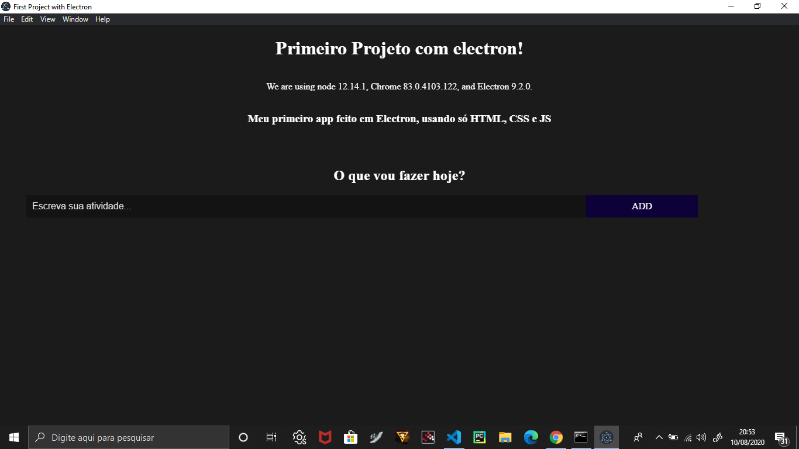

# First Project with Electron
### Using files available on Rocketseat, I managed to make my first desktop application.
### This application consists of saving "My" tasks and deleting them, if completed. In addition, it has an input that serves to place a new task.

### I am excited about this new technology. I am studying and doing other projects with him.